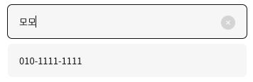

> 현재 선택된 인풋에서만 삭제 아이콘이 보이도록 처리한 방법에 대한 내용이다.

### `display: none` vs `visibility: hidden` vs `opacity: 0`

요소에 각각의 스타일 속성값을 주게 되면 렌더 될 시 요소는 화면에 보여지지는 않는다. 하지만 각각 속성 값에 따라 다르게 행동되는 경우가 있다.

- `display: none`<br />
  요소 자체를 안보여지게 하고 돔 트리에서 없애는 것이기 때문에 공간을 차지하지 않고 클릭(pointer events)이 적용되지 않는다

- `visibility: hidden`<br />
  display: none 과 같이 요소를 화면에서 보이지 않게 하지만 돔 트리 자체에서 사라지는 것은 아니여서 공간 영역은 차지하고 있다. 클릭이 적용되지 않는다

- `opacity: 0`<br />
  요소에 투명도를 줘서 화면에서 안보이게 처리하는 속성값이다. 공간을 차지하고 있고 단지 투명도만 조절된 것이므로 클릭이 적용된다.

위의 속성들의 특징을 파악하여 `opacity`를 이용하여 현재 선택된 인풋에서 아이콘이 보이도록 설정하였다.

```scss
input {
  .icon {
    opacity: 0;
  }

  &:focus + .icon {
    opacity: 1;
  }
}
```

✨ 아이콘을 처리하는 방법으로 before, after 가상요소도 생각해 보았지만 가상요소는 실제 돔 트리에 그려지는 요소가 아니기 때문에 온클릭과 같은 이벤트 적용이 불가한 요소였다. 가상요소는 스타일적으로 처리가 필요한 경우(돔에 그려질 필요가 없이 스타일적인 적용만 필요한 경우)에만 사용해 주는 것이 좋을 듯 싶다!

### `:focus` vs `:focus-visible` vs `:focus-within`

기존에는 `:focus` 라는 가상 선택자만을 알았는데 검색하다 보니 새롭게 알게 된 것이 있어서 각각에 대해 정리를 해보았다.

- `:focus`<br />
  마우스나 키보드에 의해 현재 선택되어진 요소를 스타일링하기 위해 사용되는 가상 선택자이다. 탭을 사용하여 다른 요소로 포커스가 이동하도록 하는 것도 가능하다.<br />
  포커스 상태값을 기본적으로 갖고 있는 요소가 있는 반면 없는 요소에는 contenteditable 와 tabindex 속성을 추가하여 설정가능하다.

- `:focus-visible`<br />
  해당 가상 선택자는 요소가 선택되어 있고, 선택된 걸 알려주는 스타일링이 필요한 경우에 사용된다. 만약 :focus 를 사용하여 현재 선택된 요소의 outline 스타일을 없애고 마우스가 아닌 키보드를 사용하게 되면 현재 어떠한 요소가 활성화되었는지 알 수가 없다. 이런 경우 :focue-visible 를 사용하여 요소가 선택되었을 때 보여지고자하는 스타일을 커스텀 할 수 있다.(마우스로 선택할땐 포커스 여부가 안보이고 키보드로 이동할 땐 보여지게)

- `:focus-within`<br />
  해당 가상 선택자는 :focus가 있는 자식이 포함된 경우 해당 요소를 선택해준다.

### Reference

[visibility:hidden vs display:none vs opacity:0](https://stackoverflow.com/questions/14731049/visibilityhidden-vs-displaynone-vs-opacity0)

[:focus-visible | CSS-Tricks](https://css-tricks.com/almanac/selectors/f/focus-visible/)
